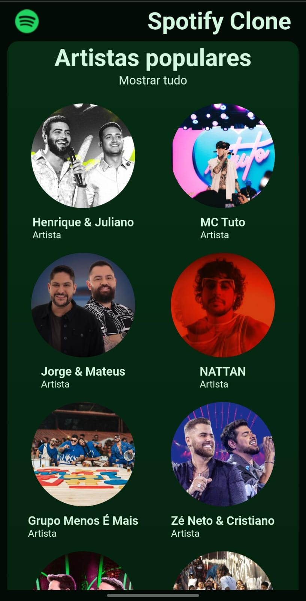
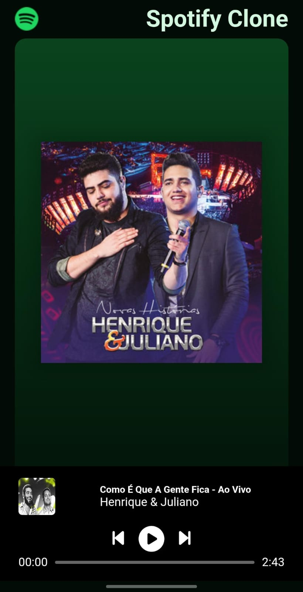

# Spotify Clone - Interface com React e Vite
 

---

### Acesso

**Site no ar:** [clone-spotify-c7lz.vercel.app](https://clone-spotify-c7lz.vercel.app/)

### Visão Geral
Este projeto é um clone da interface do Spotify, desenvolvido com o objetivo de aprofundar meus conhecimentos em tecnologias modernas do ecossistema React. O foco principal foi a aplicação de boas práticas de mercado, como componentização eficiente, estruturação de páginas com React Router e o uso de Vite como ferramenta de build.

O projeto foi inspirado em um treinamento da **Hashtag Treinamentos**.

### Funcionalidades Implementadas
* **Home Page Dinâmica:** Exibição de seções como "Artistas Populares" e "Músicas Populares", com dados consumidos de um mock local (`database.js`).
* **Interface de Player:** Player de música com todos os controles visuais, como play/pause, avançar/retroceder e barra de progresso.
* **Design Responsivo:** A interface se adapta de forma fluida a diferentes tamanhos de tela, desde desktops a dispositivos móveis.

### Tecnologias Utilizadas

### Desafios e Aprendizados
O principal desafio do projeto não foi apenas construir a interface, mas sim refatorar e otimizar o código para seguir as melhores práticas do mercado. Foi uma excelente oportunidade para evoluir de um código que "apenas funciona" para um código mais limpo, componentizado e de fácil manutenção, que é o padrão exigido em ambientes profissionais.

### Status do Projeto e Próximos Passos
* **Player:** A interface do player está 100% implementada visualmente. A funcionalidade de reprodução de áudio é um próximo passo a ser desenvolvido.
* **Backend:** O projeto foi iniciado com um escopo de backend em Node.js (a pasta `/backend` está vazia), que foi pausado para focar na excelência do frontend. Pretendo retomar esta parte no futuro para conectar a interface a uma API real.

### Demonstração

**Versão Desktop**

**Versão Mobile**

<table align="left" border="0" cellpadding="0" cellspacing="0">
  <tr>
    <td>
      
    </td>
    <td>
      
    </td>
  </tr>
</table>
